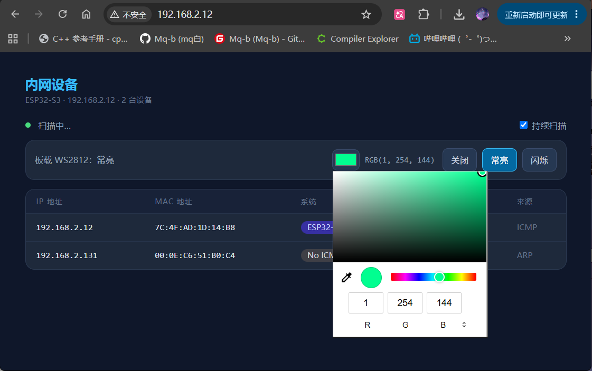
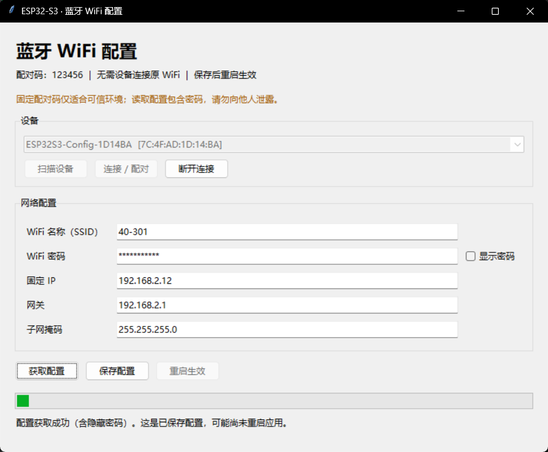
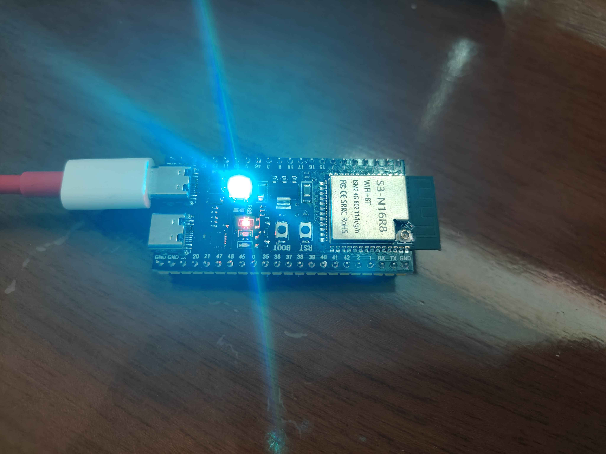

# ESP32-S3 · Web 后端服务与网段设备扫描

基于 **ESP-IDF v6.1 / C++**，在 **ESP32-S3 开发板上运行 Web 后端服务**，同时提供网页界面和 HTTP API。设备连接 WiFi 后，浏览器访问设备 IP，即可**扫描并展示当前网段中的设备**，以及控制板载 RGB LED。

另提供 [**Python 蓝牙 GUI 工具**](./tools/configure_wifi.pyw)，用于读取和修改 ESP32 WiFi 配置，无需为更换网络重新烧录。

## 能做什么

- **Web 后端服务**：开发板提供 HTTP 服务、网页及设备扫描／LED 控制 API，无需另外部署服务器。
- **网段设备扫描与展示**：由开发板扫描当前 IP 所在的 `/24` 网段，在网页表格展示发现的设备 IP、MAC、响应延迟、发现来源和系统类型推测，支持持续扫描。
- **网页控灯**：选择 RGB 颜色，切换板载 WS2812 的关闭、常亮和闪烁模式。
- **蓝牙配网**：支持被蓝牙扫描、连接、获取和修改 WiFi 配置，保存后重启生效；原 WiFi 不可用时也能配网。
- **配置持久化**：NVS 优先加载并同步 `wifi.json`，普通烧录不擦除 NVS 时保留蓝牙配置。

## 效果展示

### Web 页面：当前网段设备展示与 RGB 控灯

### Python GUI：蓝牙扫描与 WiFi 配置

### 开发板实拍：板载 RGB LED 点亮

## 怎么用

1. 参照[首次运行指南](docs/getting-started.md)，准备配置并烧录固件。
2. 浏览器访问 `http://<设备固定IP>/`，即可查看当前网段的扫描结果、控制 LED。
3. 安装 Python 蓝牙依赖后，双击 `tools/configure_wifi.pyw` 修改网络配置，详见[蓝牙配网指南](docs/ble-configuration.md)。

> 蓝牙配对码固定为 **123456**，仅适合可信开发环境；GUI 可以读取 WiFi 密码，请妥善保管配置。

## 详细文档

| 文档 | 内容 |
|---|---|
| [首次运行](docs/getting-started.md) | 创建配置、构建、烧录与访问 |
| [蓝牙配网](docs/ble-configuration.md) | GUI 操作、认证排障、GATT 协议与配置保留规则 |
| [硬件与分区](docs/hardware-and-partitions.md) | 硬件资源、Flash 布局与应用占用 |
| [开发与调试](docs/development.md) | 项目结构、USB-JTAG、VS Code 与 clangd 排障 |
