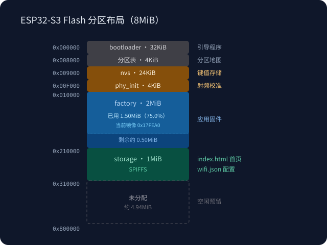

# 硬件与 Flash 分区

[返回项目首页](../README.md)

## Flash 分区布局（8MiB）

| 地址 | 分区 | 大小 | 用途 |
|---|---|---|---|
| 0x0 | bootloader | 32KiB | 上电第一段代码 |
| 0x8000 | 分区表 | 4KiB | partitions.csv 编译产物 |
| 0x9000 | nvs | 24KiB | 网络配置副本及系统键值存储 |
| 0xF000 | phy_init | 4KiB | 射频初始化数据预留 |
| 0x10000 | factory | 3MiB | 应用固件 |
| 0x310000 | storage | 1MiB | SPIFFS：首页、扫码页面、网络配置及可选上传临时文件 |
| 0x410000 起 | 未分配 | 3.9375MiB | 预留扩展（OTA / 更多存储） |

布局以 `partitions.csv` 和 `sdkconfig` 为准，当前构建的 `build/esp32s3/flasher_args.json` 已确认应用烧录到 `0x10000`，SPIFFS 镜像烧录到 `0x310000`。表中的 bootloader 和分区表大小表示预留地址区域，不代表对应镜像的实际大小；图中各区域高度不按容量比例绘制。容量统一使用二进制单位（1MiB = 1024KiB）。

### 当前固件占用

2026-10-04 本地构建的 `build/esp32s3/esp32s3_app.bin` 为 **2,112,848 字节（`0x203D50`，约 2.01MiB）**，占 3MiB 的 `factory` 分区约 **67.2%**，剩余 **1,032,880 字节（约 0.99MiB）**。这是本地构建快照，不是设备运行时测量值；重新构建后应按实际产物更新图中数值。

### SPIFFS 内容与分区迁移

- 构建时将 `data/` 打包为 `storage.bin`，包括 `index.html`、`scanner.html`、`wifi.json` 以及配置模板 `wifi.example.json`。
- 扫码选择 Flash 缓存时使用 `/spiffs/barcode-upload.tmp` 暂存 JPEG，请求结束或失败时关闭并删除临时文件。接收前会检查文件系统可用空间，并额外保留 64KiB；1MiB 是分区容量，不等于可上传图片大小，文件系统开销及已有文件也占空间。
- 相比旧布局，`factory` 从 2MiB 扩为 3MiB，`storage` 从 `0x210000` 移至 `0x310000`。从旧布局升级时需重新构建并完整烧录分区表、应用和 `storage.bin`，不能只烧录应用或沿用旧 SPIFFS 地址。
- 烧录 `storage.bin` 会覆盖新存储分区的原有文件。NVS 的地址和大小未变，未擦除或覆盖 NVS 时，启动后仍可恢复其有效网络配置并同步到 `wifi.json`。
- `0x410000` 至 `0x800000` 尚未分配；当前没有 OTA 分区，预留空间不表示已支持 OTA。

## 硬件资源

- Flash（外置）：8MB（以 `esptool.py flash_id` 实测为准）
- SRAM（内置）：512KB 运行内存
- PSRAM：视模组型号（N8R2/N8R8 等），当前未启用
